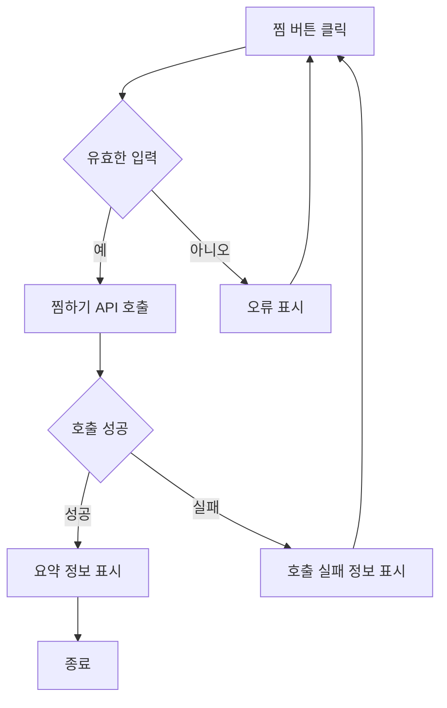

# 기능 정의서

프로젝트 정의서의 사용자 스토리를 기반으로 세부 기능을 구체적으로 정의합니다.

## 찜 사용자 스토리

### 사용자로서, 나는 특정 가게를 찜 목록에 추가하거나 삭제하고 싶습니다. 그래서 관심 있는 가게를 최신 상태로 유지할 수 있습니다.
#### 1. 기능명: 찜

* 기능 설명
  * 사용자가 특정 가게를 찜목록에 추가하거나 삭제함으로써 관심있는 가게 목록을 최신 상태로 유지할 수 있다.
* 입력 항목
  * 가게 ID: 고유식별자
  * 찜 여부: Boolean 타입

##### 1.1 사용자 액션

##### 찜목록 추가 및 삭제

* 찜 버튼 클릭
  * 입력 항목 유효성 검사 실행
  * 유효성 검사 오류 발생시 찜 절차는 종료되며 사용자에게 오류 정보 알림
  * 유효성 검사 통과시 찜 API 호출
  * API 호출 성공 후 요약 정보 표시

